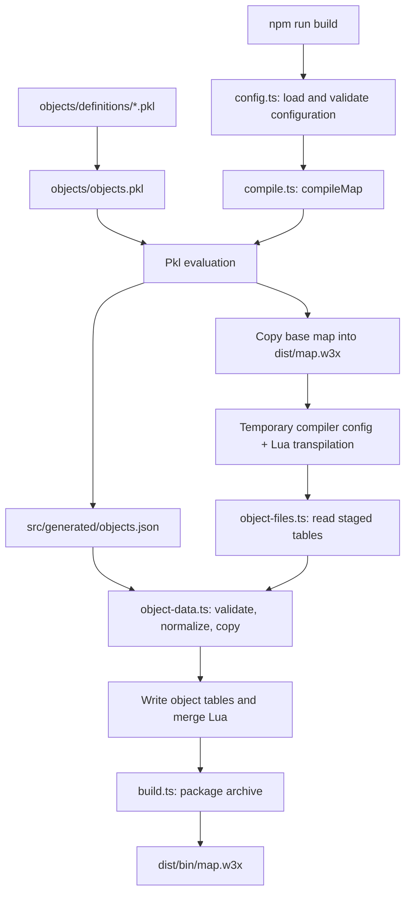

# Walkthrough: from Pkl definitions to a playable map

The main architectural change is that **the Node build pipeline now owns Pkl object injection**. Previously, `src/main.ts` invoked the object loader inside a `compiletime(...)` callback. Now, `scripts/compile.ts` runs that work explicitly after Lua transpilation.

You still author objects in Pkl and gameplay in TypeScript. The change makes the build steps easier to follow, gives all seven object categories the same processing path, and keeps build-only code outside the Lua source tree.

## 1. Start with the two execution environments

| Environment | Code | When it runs | What it can use |
| --- | --- | --- | --- |
| Your computer, through Node.js | `scripts/*.ts` | While building, generating files, or launching the game | Filesystem, Pkl CLI, compiler, binary object-data libraries |
| Warcraft III, through Lua | Gameplay in `src/main.ts` | After the map loads | Warcraft natives and `w3ts` handles such as units and timers |

The `compiletime(...)` constants in `src/main.ts` are an exception: the transformer evaluates those expressions on your computer and embeds their results in the game script. That is how the build date and compiler version strings get into the map. The game does not run Node.js or Pkl.

`tsconfig.scripts.json` checks the Node scripts. `tsconfig.json` configures the game source and TypeScript-to-Lua compilation. `npm run typecheck` checks both projects.

## 2. Follow one build from beginning to end

Run `npm run build` from the repository root. Its entry point is `scripts/build.ts`.



The paths in the diagram use the default configuration. Here is what each stage actually does:

1. **Load configuration.** `loadProjectConfig()` reads `config.json`, overlays `config.local.json` if present, and checks the required settings. `build.ts` also handles the optional `-minify` argument.
2. **Check the base map.** `compileMap()` verifies that `maps/<mapFolder>/war3map.lua` exists.
3. **Evaluate Pkl once.** The Pkl CLI turns the manifest into `src/generated/objects.json`. This is generated input for the loader; edit the Pkl definitions rather than this JSON.
4. **Prepare the staging directory.** The build replaces `dist/<mapFolder>` with a copy of the base map and removes the previous Lua bundle. It no longer deletes the entire `dist` directory.
5. **Create a temporary compiler configuration.** `createBuildConfig()` writes `tsconfig.build.<process-id>.json` beside `tsconfig.json`. It supplies absolute paths for the transformer while retaining the meaning of relative source paths. A `finally` block removes it after the compiler finishes or fails.
6. **Transpile TypeScript to Lua.** The compiler runs with that temporary configuration. The transformer still handles compile-time expressions and its existing object-data work.
7. **Inject the Pkl definitions.** `injectObjectData()` reads the resulting staged tables, applies the manifest, and saves the supported object tables. Running this after the transformer allows it to build on the transformer's output.
8. **Merge scripts.** The generated Lua bundle is appended to the staged `war3map.lua`, with a separating newline. Optional minification happens here.
9. **Package the archive.** `compileMap()` returns the staged directory. `createMapFromDir()` imports its files into a `.w3x` archive under `outputFolder`.

`dist/map.w3x` is a **directory** used during compilation. `dist/bin/map.w3x` is the **packaged file** produced by `npm run build`.

## 3. Learn the new module boundaries

| File | Responsibility | Read this when you want to… |
| --- | --- | --- |
| `scripts/config.ts` | Parse JSON, merge local settings, validate project configuration | Change or diagnose configuration behavior |
| `scripts/compile.ts` | Coordinate the build stages and merge Lua | Understand build order or compiler paths |
| `scripts/object-data.ts` | Validate definitions and apply normalized properties to library objects | Understand rawcodes, aliases, inheritance, or overrides |
| `scripts/object-files.ts` | Read and write Warcraft object-table binaries | Understand which map files receive the definitions |
| `scripts/build.ts` | Package a compiled map directory | Change archive output behavior |
| `scripts/test.ts` | Compile and launch Warcraft III | Diagnose executable paths or launch arguments |
| `scripts/utils.ts` | Logging, CLI error handling, file enumeration, buffer conversion | Understand shared plumbing |
| `scripts/tests/run.ts` | Regression checks against the actual object-data library | See executable examples of expected behavior |
| `src/main.ts` | Game initialization and sample gameplay | Add runtime logic |

The former `src/objectDataLoader.ts` was removed. Its responsibilities now live in `scripts/object-data.ts` and `scripts/object-files.ts`. The former large `scripts/utils.ts` was split into smaller modules with specific jobs.

## 4. Trace a custom unit through the system

For an example you can try, replace the empty mapping in `objects/definitions/units.pkl` with:

```pkl
units: Mapping<String, schema.RegularUnit> = new {
  ["trainingFootman"] = new schema.RegularUnit {
    id = "u001"
    base = bases.Units.Footman
    name = "Training Footman"
    goldCost = 100
  }
}
```

Keep the file's existing module declaration and imports. This walkthrough does not add the example to your map automatically.

The mapping key, `trainingFootman`, is an authoring label. `u001` is the actual engine ID, also called a rawcode. `base` identifies the existing object whose values you inherit.

The definition travels through these steps:

1. `objects/objects.pkl` includes the `units` mapping.
2. Pkl checks the schema and emits JSON. The relevant portion is approximately:

   ```json
   {
     "units": {
       "trainingFootman": {
         "id": "u001",
         "base": "hfoo",
         "name": "Training Footman",
         "goldCost": 100
       }
     }
   }
   ```

   The real evaluated object can also contain nullable fields inherited from its schema.

3. `applyObjectData()` selects the unit container and checks the ID, base, and properties.
4. `normalizeProps()` resolves `goldCost` to the unit library's `goldCostundefined` field. That awkward suffix belongs to the dependency; you do not need to use it in Pkl.
5. Once every definition has passed validation, the loader copies the base object and applies the overrides.
6. `injectObjectData()` saves the resulting unit modifications, including skin-table fields where the library places them.

Defining a unit does not place it on the map. To spawn this example, use the custom rawcode in your game code:

```ts
const unit = Unit.create(Players[0], FourCC("u001"), 0, 0, 270)!;
```

The current sample uses `Units.Footman`, which still spawns the standard Footman. Custom definitions do not automatically generate new TypeScript constants.

## 5. Understand inheritance and property normalization

The loader starts with a copy of the base object. It then applies top-level properties followed by the optional `properties` mapping.

| Input | Meaning |
| --- | --- |
| Missing or `null` field | Leave the inherited value unchanged |
| `0` | Explicitly set the value to zero |
| `false` | Explicitly disable a boolean field |
| `""` | Explicitly clear a string field |
| Empty list | Convert to an empty string for a supported string-backed field |
| List of strings or numbers | Join with commas for a supported string-backed field |

For example, `goldCost = 0` makes a unit free; `goldCost = null` leaves its inherited cost intact. These values must not be treated as equivalent.

The `properties` mapping wins when both layers address the same engine field. A top-level `goldCost` of 100 followed by a `properties` override of 25 results in 25. A null override is skipped; it does not erase the top-level value.

Normalization uses the actual base object's fields, so the same authoring name can resolve differently by category:

| Authoring name | Target field |
| --- | --- |
| Unit `goldCost` | `goldCostundefined` |
| Item `goldCost` | `goldCost` |
| Unit `movementType` | `type` |
| Upgrade `upgradeClass` | `class` |
| Buff `name` | `nameEditorOnly` |

Direct engine field names are also accepted. Loader convenience aliases such as unit `abilities` → `normal` can be used through `properties` if the Pkl class does not declare that alias as a top-level field. Unknown non-null fields and reserved `oldId`/`newId` overrides are rejected.

`properties` is an escape hatch from the Pkl schema, so it needs care: the loader checks field names and supported value shapes, but does not comprehensively validate every scalar's engine type or range.

## 6. See why binary file handling is separate

`applyObjectData()` works with in-memory library objects. It does not need to know where your map is stored. `injectObjectData()` handles the filesystem boundary around it.

| Pkl category | Library container | Object-table extension |
| --- | --- | --- |
| Heroes, units, buildings | `units` | `.w3u` |
| Items | `items` | `.w3t` |
| Abilities | `abilities` | `.w3a` |
| Buffs | `buffs` | `.w3h` |
| Upgrades | `upgrades` | `.w3q` |

The file layer also reads destructable and doodad tables (`.w3b`, `.w3d`) while processing existing map data. Those are not new Pkl authoring categories. It handles both `war3map.<extension>` and `war3mapSkin.<extension>` files.

This separation fixes two distinct omissions in the old flow: the loader did not apply buffs/upgrades, and the installed transformer's file handling omitted their tables. Adding only more loader loops would therefore not have completed the fix.

The two-pass loader validates the manifest before creating custom objects. That prevents an invalid later definition from leaving earlier custom definitions applied. It is not a general filesystem transaction: base lookups can populate the library's in-memory cache, and a later disk-write failure can still leave staging output incomplete. Packaging only starts after compilation succeeds.

## 7. Compare the original and current behavior

| Area | Original implementation | Current implementation |
| --- | --- | --- |
| Object injection | Callback inside `src/main.ts` | Explicit Node build stage after transpilation |
| Category handling | Repeated loops; buffs/upgrades omitted | Shared category dispatch for all seven categories |
| Property aliases | Global substitutions applied to every category | Resolution against the actual base object's fields |
| Nullable fields | Could overwrite inherited values | Skipped, preserving inheritance |
| Pkl invocation | Both npm scripts and compile helper invoked Pkl | Compilation invokes it once |
| Compiler configuration | Rewrote tracked `tsconfig.json` with local absolute paths | Writes and removes an ignored temporary config |
| Build cleanup | Removed all of `dist` | Replaces the current map's staging directory and Lua bundle |
| Invalid configuration | JSON errors logged, then `{}` returned | Errors propagate and terminate the command |
| Packaging failures | Some failures logged or skipped | Import/save failures throw and fail the command |
| Wine launch | Constructed a shell command string | Passes executable, arguments, and environment separately |
| Verification | No dedicated regression suite | Eight regression tests and separate type checks |

There are also authoring corrections:

- Buffs and upgrades now declare a required `base` field.
- Ability numeric fields inherit scalar schema types. The old list declarations conflicted with those types and did not provide working per-level serialization. Numeric arrays such as cooldown lists are now rejected.
- The sample player-color timer uses a maximum index of `bj_MAX_PLAYERS - 1`.

The generated unit class still extends `Wc3Object` directly. `VisualObject` and `CostableObject` exist as schema helpers, but they are not intermediate parents in the current generated unit hierarchy. The earlier project summary described that hierarchy differently from the actual code.

## 8. Use the checks in your daily workflow

| Command | What it proves |
| --- | --- |
| `npm run objects:eval` | Your Pkl definitions evaluate successfully |
| `npm run test:unit` | Regression behavior passes without Pkl or Warcraft III |
| `npm run typecheck` | Node scripts and game source satisfy their TypeScript configurations |
| `npm run build` | Pkl evaluation, transpilation, object injection, and archive creation complete |
| `npm test` | Compiles the staged map and attempts to launch Warcraft III |

`npm test` retains its original game-launch meaning. It does not run the regression suite and does not package a new archive through `build.ts`.

The regression suite covers inheritance and aliases, item-specific fields, binary save/load for all seven categories, invalid manifests, existing-ID collisions, buff/upgrade file persistence, local configuration merging, and temporary compiler configuration isolation.

After the refactor, all eight tests and both type checks passed. The full build also passed using Pkl 0.32.1 and produced `dist/bin/map.w3x`. The project's definition registries were empty during that full build; populated-category behavior was exercised by the regression tests. In-game behavior has not been verified.

## 9. Diagnose problems by their stage

| Symptom | Where to look |
| --- | --- |
| `pkl` cannot be found or executed | Check `pkl --version` in the same terminal/session; verify PATH and executable access |
| Pkl type or constraint error | The indicated definition and its schema under `objects/schema/` |
| Duplicate or existing-ID error | The definition's `id`, other manifest entries, and existing target-table objects |
| Base does not exist | The `base` rawcode and selected object category |
| Unknown property | Generated schema field names, spelling, and `normalizeProps()` aliases |
| Per-level array error | Use the supported scalar ability field; per-level numeric arrays are not implemented |
| TypeScript or Lua compiler error | Compiler output and the relevant source/configuration |
| Game does not launch | `config.local.json`, `gameExecutable`, optional Wine settings, and launch arguments |

Project settings merge shallowly: a local `launchArgs` array replaces the entire default array. Malformed local JSON is an error rather than a reason to silently fall back to defaults.

Run commands from the repository root. A failed build can leave an older packaged archive in `outputFolder`, because the build no longer clears all output first. Check the command's success and archive timestamp before using the file.

For a first code-reading pass, open `scripts/build.ts`, follow its call into `scripts/compile.ts`, then follow `injectObjectData()` into `scripts/object-files.ts` and `applyObjectData()` into `scripts/object-data.ts`. Finish with `scripts/tests/run.ts` to see the expected behavior demonstrated with real library objects.
